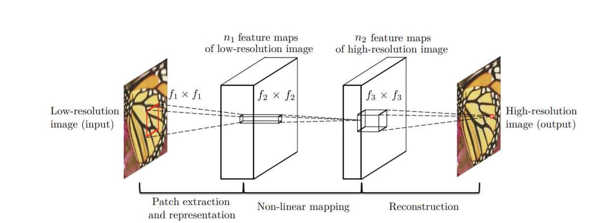
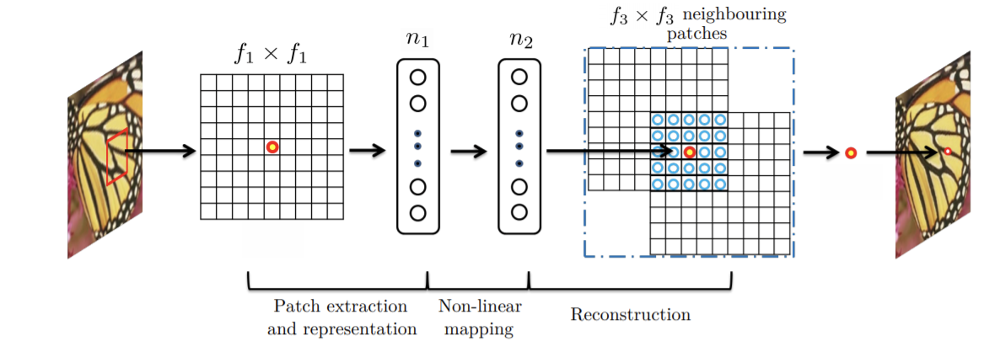
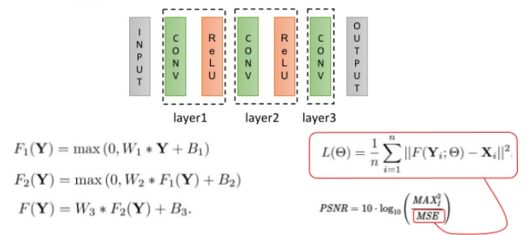

# Image Super-Resolution Using Deep Convolutional Networks
[논문 링크](https://arxiv.org/pdf/1501.00092.pdf)

## Background
- 평가 방식
	- PSNR (Peak Signal-to-Noise Ratio): 최대 신호 대 잡음비 (영상 화질 손실정보에 대한 평가)

## Summary
  
> Fig. 2. Given a low-resolution image Y, the first convolutional layer of the SRCNN extracts a set of feature maps. The
second layer maps these feature maps nonlinearly to high-resolution patch representations. The last layer combines
the predictions within a spatial neighbourhood to produce the final high-resolution image F(Y).  

이 논문에서는  ground_truth를 X, 저해상 이미지를 Y로 레이어들을 통과하여 최종적으로 얻은 고해상도 이미지를 (prediction) F(Y)로 나타내고 있다. 모델을 설명하자면 첫번째 레이어에서 f1개만큼의 컨볼루션 레이어를 통해서 `feature extraction`을 수행한다. 다음으로는 `1x1 convolution layer`을 통해서 `non-linear mapping`을 진행하고, 마지막에서는 Relu를 사용하지 않고 `linear mapping`만을 사용해 한 점의 픽셀 값을 regression 한다.
  
> Fig. 3. An illustration of sparse-coding-based methods in the view of a convolutional neural network  

*수식화해서 살펴보자면..*

  
> 출처: [Taegyun Jeon님의 슬라이드](https://www.slideshare.net/TaegyunJeon1/pr12-image-super-resolution-using-deep-convolutional-networks)  

저해상도 이미지와 출력으로 만들고자 하는 고해상도 이미지들 사이에서 `convolution`과 `Relu`를 이용한 `activation`이 구성되어있다. 수식으로 보자면 첫번째 레이어를 통과할 때에는 `W1(Filter)`과 `low resolution image` Y와의 컨볼루션을 `relu`로 `activatie`하고, F2, 그리고 마지막 linear mapping인 F를 통과하여 최종 결과를 얻어낸다. 이때, 얻어낸 결과인 F(Y)와 실제 grount_truth인 X 간의 차이를 이용하여 MSE로 Loss function을 구성한다. 만약, 결과값과 grount_truth간의 차이가 크다면 분모값이 커지게 되어 PSNR(영상 화질 손실 정도)가 커지게 된다.

## Contents
### Convolutional Neural Networks for Super-resolution
위 Fig2의 과정에 대해서 추가로 설명하자면, 이 논문에서 입력 저해상도 이미지를 고해상도 이미지로 복원하는 mapping은 아래의 세 가지 연산으로 구성된다.  
1. Patch extraction and representation: 저해상도 이미지로부터 patch 추출하기  
2. Non-linear mapping: 다차원 patch 벡터를 다른 다차원 패치 벡터로 매핑하기  
3. Reconstruction: 다차원 patch 벡터에서 최종 고해상도 이미지 생성하기.  

## Reference
* 이미지(Fig2, Fig3): 원본 논문, https://arxiv.org/pdf/1501.00092.pdf  
* Taegyun Jeon님의 youtube 발표영상, https://www.youtube.com/watch?v=1jGr_OFyfa0&t=668s
