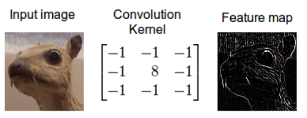
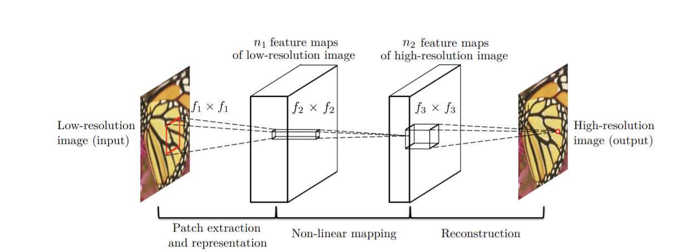
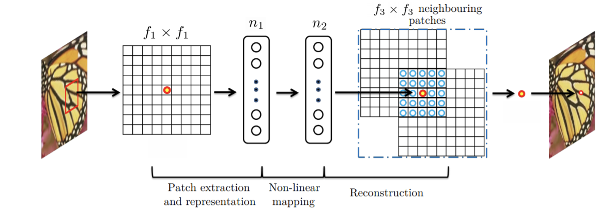
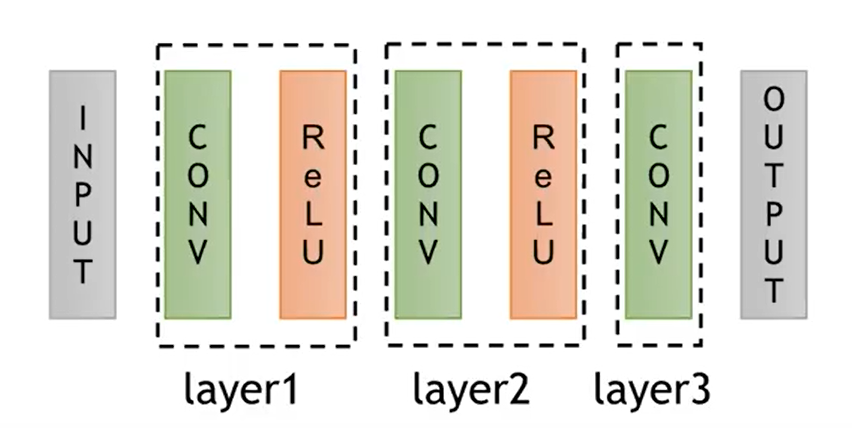
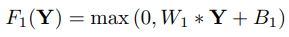
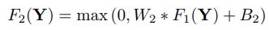
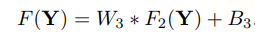
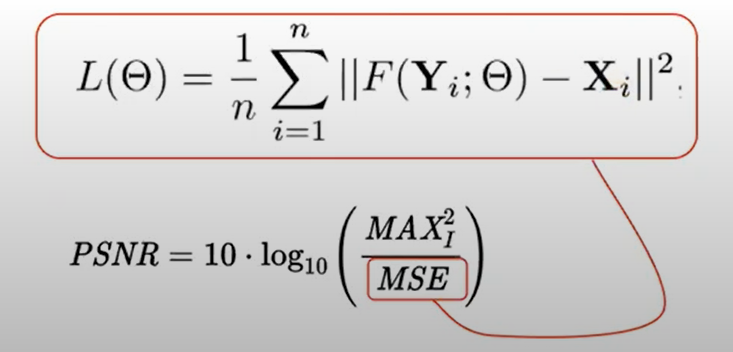

# Image Super-Resolution Using Deep Convolutional Networks

## Background
평가 방식
	- PSNR (Peak Signal-to-Noise Ratio): 최대 신호 대 잡음비 (영상 화질 손실정보에 대한 평가)

 Convolution 

컨볼루션이란...  
정보를 섞는 것으로 상상할 수 있다. 어떠한 특정한 룰에 따라 2개의 양동이에 나뉘어져있던 정보를 하나의 양동이에 섞는다. 각각의 양동이는 그 자신의 룰을 갖고 있고, 그것을 통해 어떻게 정보들이 하나의 양동이에 서로 섞이는지 알려준다. 즉, 컨볼루션은 2개의 정보가 서로 섞이는 순서가 있는 절차이다.

이미지에 컨볼루션을 적용할 때, 첫번째 양동이에는 너비와 높이를 가진 원본 이미지(3차원 행렬의 픽셀 전체)가 들어가고, rgb 색상 채널들이 하나의 행렬이 된다. 두번째 양동이에는 컨볼루션 커널이 있고, 이는 실수의 단일 행렬로 이루어져 있으며 어떻게 원본 이미지와 커널을 컨볼루션 연산에 의해서 섞는지에 대한 룰로써 크기와 패턴들이 구성된다. 이 커널의 출력은 피쳐 맵이라고 불리는 이미지이다. (특징을 추출해 내는 것)

## Summary
  

> Fig. 2. Given a low-resolution image Y, the first convolutional layer of the SRCNN extracts a set of feature maps. The
second layer maps these feature maps nonlinearly to high-resolution patch representations. The last layer combines
the predictions within a spatial neighbourhood to produce the final high-resolution image F(Y).  

이 논문에서는  ground_truth를 X, 저해상 이미지를 Y로 레이어들을 통과하여 최종적으로 얻은 고해상도 이미지를 (prediction) F(Y)로 나타내고 있다. 모델을 설명하자면 첫번째 레이어에서 f1개만큼의 컨볼루션 레이어를 통해서 `feature extraction`을 수행한다. 다음으로는 `1x1 convolution layer`을 통해서 `non-linear mapping`을 진행하고, 마지막에서는 Relu를 사용하지 않고 `linear mapping`만을 사용해 한 점의 픽셀 값을 regression 한다.  

* Convolutional Neural Networks for Super-resolution
위 Fig2의 과정에 대해서 추가로 설명하자면, 이 논문에서 입력 저해상도 이미지를 고해상도 이미지로 복원하는 mapping은 아래의 세 가지 연산으로 구성된다.  
	1. Patch extraction and representation: 저해상도 이미지로부터 patch 추출하기. 이 과정에서 추출된 patch들은 특징을 가진다. (feature-map)
	2. Non-linear mapping: 다차원 patch 벡터를 다른 다차원 패치 벡터로 매핑하기. (다차원 patch <-- non-linear mapping --> 다른 다차원 patch)
	3. Reconstruction: 다차원 patch 벡터에서 최종 고해상도 이미지 생성하기.

  

> Fig. 3. An illustration of sparse-coding-based methods in the view of a convolutional neural network  

*수식화해서 살펴보자면..*

저해상도 이미지와 출력으로 만들고자 하는 고해상도 이미지들 사이에서 `convolution`과 `Relu`를 이용한 `activation`이 구성되어있다. 수식으로 보자면 첫번째 레이어를 통과할 때에는 `W1(Filter)`과 `low resolution image` Y와의 컨볼루션을 `relu`로 `activatie`한다.

  

 다음은 `non-linear mapping`을 하는, F2이다.

  

그리고 마지막 `linear mapping`인 F를 통해 `Reconstruction`하여 최종 결과를 얻어낸다.

  

이때, 얻어낸 결과인 F(Y)와 실제 grount_truth인 X 간의 차이를 이용하여 MSE로 Loss function을 구성한다.

   

 만약, 결과값과 grount_truth간의 차이가 크다면 분모값이 커지게 되어 PSNR(영상 화질 손실 정도)가 작아지게 된다.

## Experiments
  

> 여러 SR 기법들의 PSNR 비교 그래프와 사진  

위의 그래프는 Original, Bicubic, Sparse-coding-based method(SC), SRCNN에 대한 PSNR 값의 비교 그래프와 사진이다. PSNR은 높을수록 해상도가 높은 것으로 여겨지며, 해상도의 척도로써 많이 쓰인다. 따라서 위의 그래프를 살펴 보았을 때, SC나 Bicubic의 PSNR 값보다 SRCNN의 PSNR 값이 훨씬 높은 것으로 보아 해상도가 더 좋다는 것을 알 수 있다. 또한, 옆의 사진에서의 비교를 봐도 두 방법보다는 나비의 날개부분의 문양이 좀 더 덜 blur하다는 것을 볼 수 있다.

> filter 크기에 따른 PSNR 비교

Training은 조건에 따라 다른 결과를 보이는데, 먼저 `filter`의 크기를 달리했을 때에는 `filter`의 크기를 키울수록 더 높은 PSNR 값을 보였다. 이는 `filter`의 크기가 클수록 특징을 더 잘 받아들이기 때문인 것으로 추측하고 있다.

> 구조를 더 깊게 했을 때 PSNR 비교

다음으로, 구조를 더 깊게 했을 때이다. 구조를 더 깊게 했을 때엔 더 결과가 안좋아지는 모습을 나타낸다. 기존의 3개의 layer 결과보다 9-1-1-1-5로 더 깊게 layer를 늘렸을 때 성능이 더 떨어지는 것을 확인할 수 있다.

## Reference
* 논문 : [Image Super-Resolution Using Deep Convolutional Networks](https://arxiv.org/pdf/1501.00092.pdf)
* 이미지: [Taegyun Jeon님의 슬라이드](https://www.slideshare.net/TaegyunJeon1/pr12-image-super-resolution-using-deep-convolutional-networks)   
* Taegyun Jeon님의 youtube 발표영상, https://www.youtube.com/watch?v=1jGr_OFyfa0&t=668s
